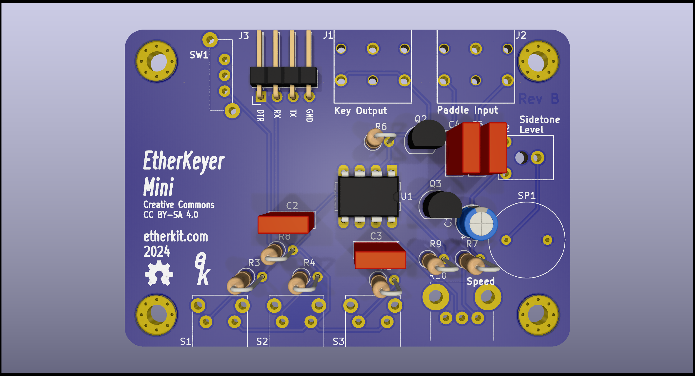

# EtherKeyer Mini

A simple keyer that does the basic functions that you need.



## Requirements

In order to program the message memories, change parameters other than the keyer speed, and update the firmware, you'll need a serial terminal that can connect to the 5 V TTL UART on EtherKeyer Mini. A common PC USB UART adapter dongle with Dupont pins for the UART connection are a great choice. **In order to load new firmware onto EtherKeyer Mini, your adapter must have the DTR pin available.**

A CR2032 lithium coin cell is required for powering EtherKeyer Mini.

## Functions

### Speed Potentiometer

The knob control on the right side of the front of EtherKeyer Mini controls the keyer speed, from a minimum of 5 WPM to a maximum of 40 WPM. This control can be adjusted at any time and responds immediately.

### Pushbuttons

#### Short Press

Cancel any message playback by pressing any button or paddle.

- 1 - Play Message Memory 1
- 2 - Play Message Memory 2
- 3 - Play Message Memory 3

#### Long Press

- 1 - Tune Mode (press any key to exit0)
- 3 - Enter/Exit UART Mode

### UART Mode

The format for interacting with EtherKeyer Mini via the UART is very simple. In order to place EtherKeyer Mini into UART mode, press and hold button 3 for at least one second. If your serial terminal is open when you do this, you'll get a greeting from EtherKeyer Mini to let you know it is ready for commands.

Each message memory has a maximum size of 40 characters.

Exit UART mode by pressing and holding button 3 again for at least one second, or issue the ```X:``` command in the serial terminal.

#### Serial Terminal Parameters

19200 baud, send New Line only

#### Query

- ```W?``` - Keyer speed
- ```1?``` - Message memory 1
- ```2?``` - Message memory 2
- ```3?``` - Message memory 3

#### Parameter Set

- ```1:<message>``` - Message memory 1
- ```2:<message>``` - Message memory 2
- ```3:<message>``` - Message memory 3
- ```X:``` - Exit UART Mode
- ```R:``` - Reverse Paddle Terminals
- ```N:``` - Normal Paddle Terminals
- ```A:``` - Set Iambic A Mode
- ```B:``` - Set Iambic B Mode

## Firmware Updates

__Please see the Requirements section above for the hardware necessary for the UART adapter.__

EtherKeyer Mini uses an ATtiny85 microcontroller with the [urboot bootloader](https://github.com/stefanrueger/urboot) pre-installed. Loading new firmware onto EtherKeyer Mini requires the use of [avrdude](https://github.com/avrdudes/avrdude) version 7.2 or later.

Connect EtherKeyer Mini to your serial connection of choice via the DTR, TX, RX, and GND pins on the UART header on the back of the PCB. Issue the following command in a terminal session in order to load a new firmware image onto EtherKeyer Mini:

```avrdude -curclock -pattiny85 -b57600 -P /dev/ttyUSB0 -v -U flash:w:EtherKeyerMini.ino.hex:i```
