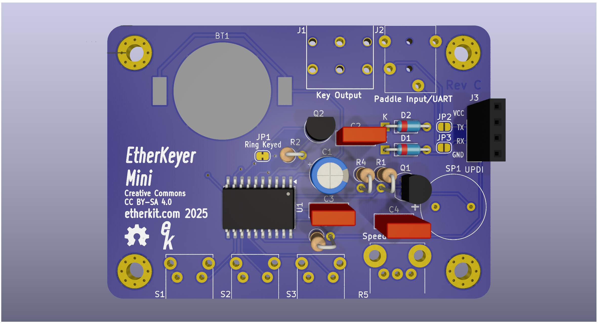

# EtherKeyer Mini

A simple keyer that does the basic functions that you need.



## Requirements

In order to program the message memories, change parameters other than the keyer speed, and update the firmware, you'll need a serial terminal that can connect to the 5 V TTL UART on EtherKeyer Mini via the 3.5 mm TRRS paddle jack. The Etherkit UART Adapter board has a USB-C connection for your PC and the requisite 3.5 mm TRRS jack, so that all that you need to connect to EtherKeyer Mini is a 3.5 mm TRRS cable.

A CR2032 lithium coin cell is required for powering EtherKeyer Mini.

## Functions

### Speed Potentiometer

The knob control on the right side of the front of EtherKeyer Mini controls the keyer speed, from a minimum of 5 WPM to a maximum of 40 WPM. This control can be adjusted at any time and responds immediately.

### Pushbuttons

#### Short Press

Cancel any message playback by pressing any button or paddle.

- 1 - Play Message Memory 1
- 2 - Play Message Memory 2
- 3 - Play Message Memory 3

#### Long Press

- 1 - Tune Mode (press any key to exit)
- 2 - Toggle Internal Sidetone
- 3 - Enter/Exit UART Mode

### UART Mode

The format for interacting with EtherKeyer Mini via the UART is very simple. In order to place EtherKeyer Mini into UART mode, press and hold button 3 for at least one second. If your serial terminal is open when you do this, you'll get a greeting from EtherKeyer Mini to let you know it is ready for commands.

Each message memory has a maximum size of 40 characters.

Exit UART mode by pressing and holding button 3 again for at least one second, or issue the ```X:``` command in the serial terminal.

#### Serial Terminal Parameters

19200 baud, send New Line only, no flow control.

#### Query

- ```W?``` - Keyer speed
- ```1?``` - Message memory 1
- ```2?``` - Message memory 2
- ```3?``` - Message memory 3

#### Parameter Set

- ```1:<message>``` - Message memory 1
- ```2:<message>``` - Message memory 2
- ```3:<message>``` - Message memory 3
- ```X:``` - Exit UART Mode
- ```R:``` - Reverse Paddle Terminals
- ```N:``` - Normal Paddle Terminals
- ```A:``` - Set Iambic A Mode
- ```B:``` - Set Iambic B Mode
- ```S:``` - Sidetone On
- ```O:``` - Sidetone Off

## Firmware Updates

__Please see the Requirements section above for the hardware necessary for the UART adapter.__

EtherKeyer Mini uses an ATtiny3226 microcontroller with the Optiboot bootloader pre-installed. You can use load new firmware onto EtherKeyer Mini via a UART adapter connected to the paddle jack (the easiest way to do so is using the Etherkit UART Adapter board with a 3.5 mm TRRS cable). You can also use a standard USB-UART adapter connected to jack J3 to program the ATtiny3226 via UPDI protocol.

Programming via the paddle jack is accomplished using the Arduino IDE using the [megaTinyCore](https://github.com/SpenceKonde/megaTinyCore) board support package. Use [this link](https://github.com/SpenceKonde/megaTinyCore/blob/master/Installation.md) for instructions on how to add this board support package to your Arduino IDE. Once you have added the board support package, connect your UART adapter to your PC. In Arduino IDE, select the "ATtiny3226/1626/826/426 w/Optiboot" as your board and port corresponding to your programming UART adapter. Make sure to set all of the specific board settings in the Tools menu of Arduino IDE to those shown below:


Once you have all of these settings correct, you can load the EtherKeyerMini.ino sketch into the Arduino IDE and then use the Sketch > Upload menu command or use the upload button on the toolbar.
